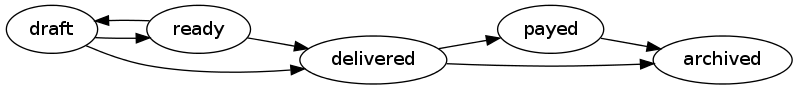

Yii 2 lifecycle behavior
========================

Define the lifecycle of a model by defining allowed satus changes.


Installation
------------

This is an extension for the [Yii 2](http://www.yiiframework.com/).

Installation is recommended to be done via [composer][] by running:

	composer require cebe/yii2-lifecycle-behavior

Alternatively you can add the following to the `require` section in your `composer.json` manually
and run `composer update` afterwards:

```json
"cebe/yii2-lifecycle-behavior": "~1.0.0"
```

[composer]: https://getcomposer.org/ "The PHP package manager"


Usage
-----

You can add the behavior to an [ActiveRecord][] class. It does not work with `yii\base\Model`
because it relies on the old-attribute feature which is only available in active record.

You can add the behavior to the model by creating a `behaviors()` method if there is none yet, or
add it to the list of exising behaviors.

The following example shows how to define the allowed status changes:

```php
	public function behaviors()
	{
		return [
			'lifecycle' => [
				'class' => 'cebe\lifecycle\LifecycleBehavior',
				'validStatusChanges' => [
					'draft'     => ['ready', 'delivered'],
					'ready'     => ['draft', 'delivered'],
					'delivered' => ['payed', 'archived'],
					'payed'     => ['archived'],
					'archived'  => [],
				],
			],
		];
	}
```

The above state transitions can be visualized as follows:




[ActiveRecord]: http://www.yiiframework.com/doc-2.0/guide-db-active-record.html